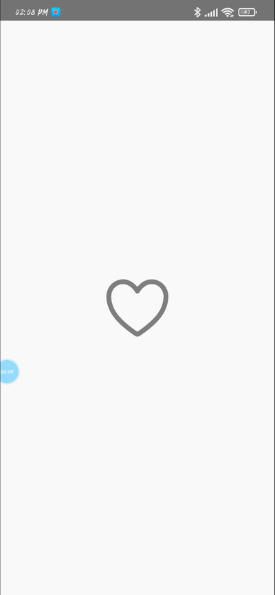

# Getting Started

> **Note**: Make sure you have completed the [React Native - Environment Setup](https://reactnative.dev/docs/environment-setup) instructions till "Creating a new application" step, before proceeding.

## Like Button With Animation



## Step 1: Start the Metro Server

First, you will need to start **Metro**, the JavaScript _bundler_ that ships _with_ React Native.

To start Metro, run the following command from the _root_ of your React Native project:

```bash
# using npm
npm start

# OR using Yarn
yarn start
```

## Specific configuration

```javascript
  const likeOnPress = () => {
   // Heartbeat for Outline Icon
    Animated.sequence([
      Animated.spring(scaleOutline, {
        toValue: 1.3,
        useNativeDriver: true,
        delay: 0,
        speed: 100,
      }),
      Animated.spring(scaleOutline, {toValue: 1, useNativeDriver: true, delay: 0}),
    ]).start();
    // Heartbeat for filled icon
    Animated.sequence([
      Animated.spring(scale, {
        toValue: 1.3,
        useNativeDriver: true,
        delay: 0,
        speed: !liked ? 1000 : 100,
      }),
      Animated.spring(scale, {
        toValue: !liked ? 1 : 0, // It will be shown incase you like
        useNativeDriver: true,
        delay: 0,
      }),
    ]).start();
    setLiked(prev => !prev);
  };
```

## Contacts

- LinkedIn: https://www.linkedin.com/in/yasin-unluoglu-ba47831a3/
- E-Mail: ysn.unlgl@gmail.com
